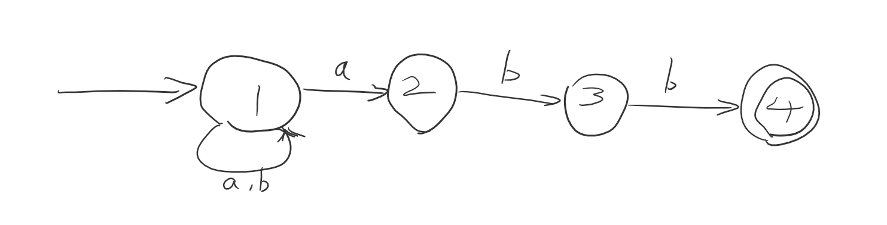

# Formal Languages
Assembly Language | High-level Language
---|---
simple sturcture | more complex
translation to machine language is easy | usually 1 keyword is many machine language  
## How do we handle complexity?
* we want a formal theory of string recognition.  
* which is a general principle that works in the context of any programming language

---

## Definitions:
**alphabet**: finite set of symbols such as {a, b, c}, denoted as $\sum$

**strings**: finite sequence of symbols

**length of strings**: $|w| =$ number of chars in $w$ 
*  $\epsilon  \text{ (empty string)} \notin \sum$,  $|\epsilon a \epsilon| = 1$ 

**language**: set of strings. e.g. $\{a^{2n}b, n\geq0\}$, then $aaaab \in$ language. 

> $\epsilon$ is empty string  
> $\{\}$ or $\emptyset$ is empty set  
> $\{\epsilon \}$ is a set of 1 string

Symbol could be anything. For example, when $\sum = \{dot, dash\}$, $L = \text{Morse Code}$

## How to recognize if a given string belongs to a language?

That depends on how complex the language is: 
* $\{a^{2n}b, n\geq0\}$ is easy
* valid MIPS program - almost as easy
* valid JAVA, C, C++ program - harder
* some languages - impossible

We characterize languages according to how hard the recognization process is.  
Classes of languages:
* **finite** ---- only finite # of strings ---- brute force?  tree?   
* regular
* context-free
* context-sensitive
* recursive
* recursively enumerable
* etc. (impossble)

## Regular languages
Build from 
* finite languages  
* union
* concatenation
* repetition

Regular Expression | Set Notation | Description  
---|---|---
$\emptyset$ | $\{\}$ | empty language  
$\epsilon$ |  $\{\epsilon \}$ | languge containing only the empty string  
$E_1 \| E_2$ or $E_1+E_2$ |  $L_1 \cup L_2$ |   
$E_1 \cdot E_2$ or $E_1E_2$ |  $L_1 \cdot L_2$ or $L_1L_2$ |   
$E^*$ | $L^*$ 


Procedure: * before  $\cdot$ before | 

**Is C a regular language?**  
**YES.** $C \Subset \{\text{valid C tokens}\}^*$

---

## Deterministic Finite Automata (DFAs)
is a 5 tuple $M=(\sum, Q, q_0, A, \delta)$
* $\sum$ is a finite, non-empty set of set-alphabet
* $Q$ is a finite, non-empty set of states
* $q_0 \in Q$ is start state
* $A \Subset Q$ is set of accepting states
* $\delta: (Q \times \sum) \Rightarrow Q$ translation function   

**State** represents the pattern recognized so far.

### Kleene Theorem
$L$ is regular iff $L= L(M)$ for some DFA $M$

Determining whether the state is in language:
```c++
int state = q0;
char ch;
while not EOF do{
    read ch;
    switch (state) {
        case q0: {
            switch (ch) {
                case 'a':
                    state = ...;
                case 'b':
                    state = ...;
                    ...
            }
        }
        case q1: {
            switch (ch) {
                case 'a':
                    state = ...;
                case 'b':
                    state = ...;
                    ...
            }
        }
        ...
    }
}
return state in A
```

> Example: let $L=\{$ binary strings with no leading 0$\}$  
> Then $\sum = \{0, 1\}

---
## Non-deterministic Finite Automata (NFA)
allows more than 1 translations for a symbol from the same state  

>Example: $L = \{w \in \{a,b\}^*  | \text{w ends in abb}\}$   
> 
> This is a DFA. It must read one input at a time.
> 
> This is NFA
* as long as we have a path to the accepting state we are good
* often have clearer diagrams
* but machine have to "guess" which choice to make

So NFA is also $M = \{\sum, Q, q_0, A, \delta\}$, where  
$\delta: (Q, \sum) \rightarrow \text{subset of } Q$


$S^*$ for NFAs: set of states $\times \sum \rightarrow $ set of states

$S^*(q_s, \epsilon) = q_s$   

$S^*(q_s,  cw) =S^*((\cup_{q\in q_s} \delta(q, c) ), w)$

Accept w if $S^*(\{q_0\}, w) \cap A \neq \empty$    

Code:  

```python
states <- {q0}
while not EOF do
	ch = read()
	states = 
end do
if states intersect A is not 0:
    accept
else reject
```

Simulate input `baabb`

| Input Read | States                      |
| ---------- | --------------------------- |
| $\epsilon$ | {1}                         |
| b          | {1}                         |
| ba         | {1,2}                       |
| baa        | {1,2} $\cup \empty$ = {1,2} |
| baab       | {1,3}                       |
| baabb      | {1,4}                       |

